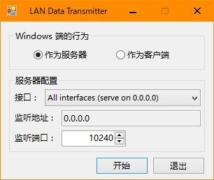
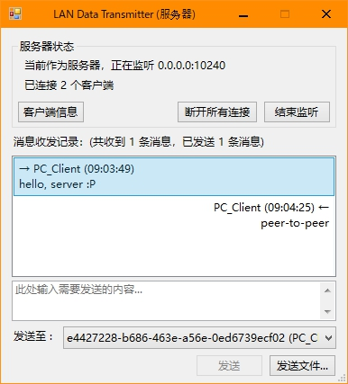
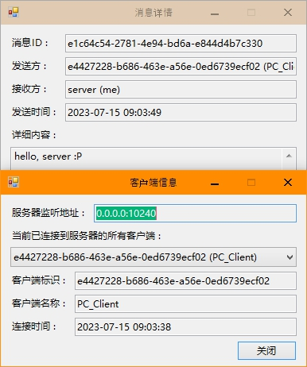
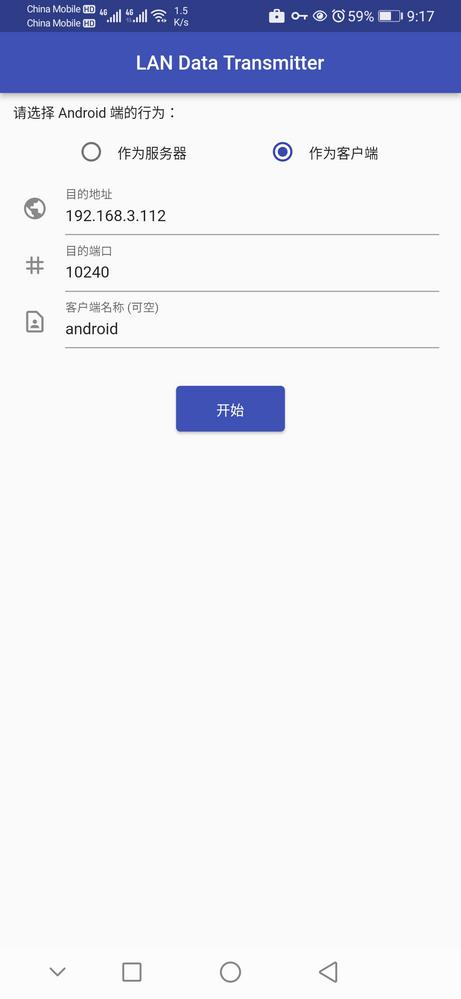
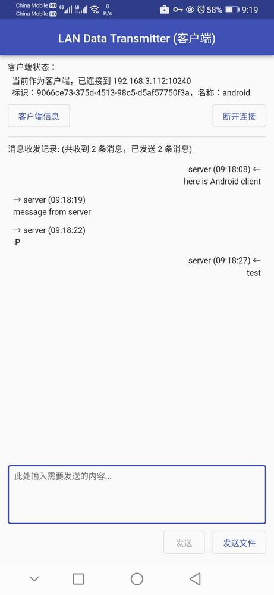

# LanDataTransmitter

+ Windows (developed by Winforms) and Android (developed by Flutter) clients to transmit data, such as plain text and file, between hosts in the same LAN.
+ Note: I'm busy with az's work these days, so plz wait for bug-fixing, feature-adding and refactoring (2022/04/04).

### Environment

+ Windows: .NET Framework v4.8, C# 8.0
+ Android: Flutter 2.10.1 stable channel, Dart 2.16.1

### Screenshots

||||
|---|---|---|
||||

### Reference

+ [gRPC C# Quick start](https://grpc.io/docs/languages/csharp/quickstart/)
+ [gRPC C# Helloworld Example](https://github.com/grpc/grpc/blob/master/examples/csharp/Helloworld/README.md)
+ [Create gRPC services and methods - Server streaming method](https://docs.microsoft.com/en-us/aspnet/core/grpc/services#server-streaming-method)
+ [System.Threading.Channelsを使う](https://qiita.com/skitoy4321/items/c19ca3dc7624a7049fd5)
+ [C# Windows7/Vista style ListView](https://stackoverflow.com/questions/4462973/c-sharp-windows7-vista-style-listview)
+ [C# ListView Disable Horizontal Scrollbar](https://stackoverflow.com/questions/4466979/c-sharp-listview-disable-horizontal-scrollbar)
+ [Making ListView scrollable in vertical direction](https://stackoverflow.com/questions/2309046/making-listview-scrollable-in-vertical-direction)
+ [ObjectListView .NET ListView on caffeine, guarana and steroids](http://objectlistview.sourceforge.net/cs/index.html)
+ [szotar - default source code](https://code.google.com/archive/p/szotar/source/default/source)
+ [Awaiting Asynchronous function inside FormClosing Event](https://stackoverflow.com/questions/16656523/awaiting-asynchronous-function-inside-formclosing-event)
+ [gRPC Dart Quick start](https://grpc.io/docs/languages/dart/quickstart/)
+ [gRPC Dart Helloworld Example](https://github.com/grpc/grpc-dart/blob/master/example/helloworld/README.md)
+ [Dart package, protoc_plugin](https://pub.dev/packages/protoc_plugin)
+ [Dart package, channel](https://pub.dev/packages/channel)
+ [Interconnecting emulator instances](https://developer.android.com/studio/run/emulator-networking#connecting)
+ [Set up port forwarding](https://developer.android.com/studio/command-line/adb#forwardports)
+ [Sending files via gRPC](https://ops.tips/blog/sending-files-via-grpc/)
+ [gRPC + Image Upload](https://stackoverflow.com/questions/34969446/grpc-image-upload)
